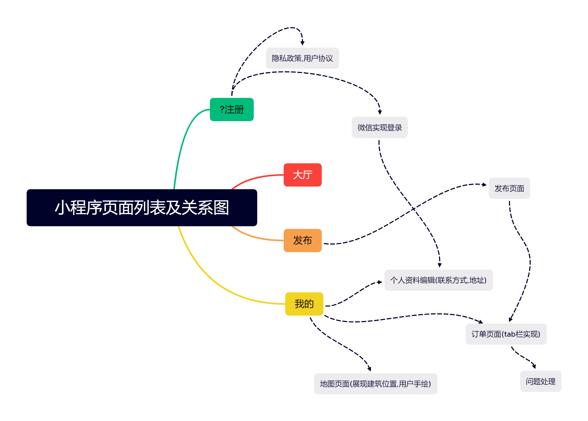
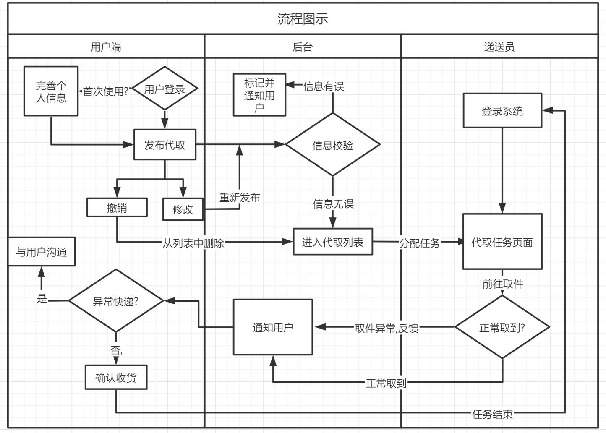

## 这是BUPT快递服务项目的简要说明

项目相关文件参见 ./project 文件夹

[隐私政策](./project/隐私政策.md)

[用户协议](./project/用户协议.md)

[页面排版一览](./project/美工/Overview.md)

[数据库相关](.\project\开发\database.md)

### 页面图示:

### 流程图:

### 部分信息

1.小程序宽度为750rpx=375px,高度为1334rpx=667px

2.配色方案 [Flat UI Palette v1](https://flatuicolors.com/palette/defo) 

3.主题色: 深蓝 #2980b9

### 日程安排

**2.20** 前后端开发起始

### 待办项

#### 1.PPT及解说部分

1.明确产品需求,具体,有说服力

2.概括产品的突出特点

3.遇到的问题和解决过程

4.核心竞争力

#### 2.开发部分

1.业务逻辑实现

2,代码精简优化

3.地址信息单独存储,通过openid换取

#### 3.设计部分

1.美工制图及设计优化(明确设计理念,统一设计风格(主题色,ui等等))

2.小程序前端开发

3.Tabbar页面初步为大厅,发布和我的

#### 4.杂项

1.涉及到了用户隐私数据,应该明确隐私政策

2.添加积分制度和审核制度来提高可靠性,安全性,高效性

3.保障测试期

4....

Last update:2023/2/15